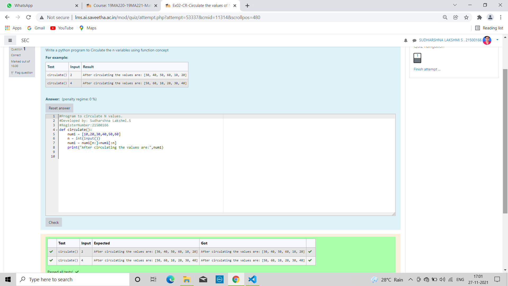

# Circulate-the-values-of-N-variables
## Aim:
To write a python program to circulate the n variables using function concept
## Equipment’s required:
PC
Anaconda - Python 3.7
## Algorithm: 
### Step 1: 
Get values from the user.
### Step 2: 
Use default argument as it has input as default. 
### Step 3: 
Get the value from the user for the number of rotation
### Step 4: 
Using the slicing concept rotate the list

### Step 5: 
Then print the values.
### Step 6: 
WOW!Finally you got the output.
## Program:
```
#Program to circulate N values.
#Developed by: Sudharshna Lakshmi.S
#RegisterNumber:21500166
def circulate():
    num1 = [10,20,30,40,50,60]
    n = int(input())
    num1 = num1[n:]+num1[:n]
    print("After circulating the values are:",num1)

```

## Output:


## Result:
Thus circulating the n variables using python are successfully executed. 